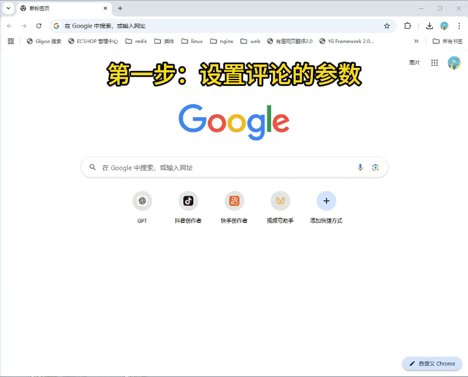
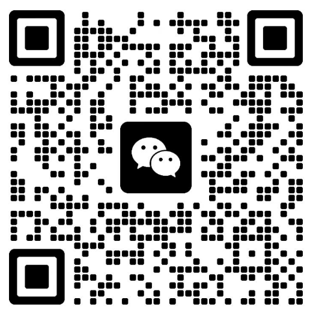

# 麦穗AI智能体
矩阵运营解决方案 ｜软件｜内容生产 智能体平台研发 ｜AI智能体｜效率工具 获客成交

# 作者声明： 
**没有在任何平台进行代码售卖，请谨慎鉴别，上当受骗作者一律不负责**

**本项目仅供学习交流，严禁用于任何商业和非法用途，非本人使用而产生的纠纷与一切后果均与本人无关。**

# 简介
抖音、小红书、快手、TikTok、Youtube、Instagram等全平台营销获客，评论截流，自动发布，数据采集
评论、收藏、点赞、发布接口逆向破解。

**特点：**
完全模拟人类行为，保障账号安全、支持多矩阵账号多IP隔离

# 软件功能

## 功能列表
<table>
  <tr>
    <th>平台</th>
    <th>可用功能</th>
  </tr>
  <tr>
    <td rowspan="12"><strong>小红书</strong></td>
    <td><a href="#xhs01">搜索结果评论采集</a></td>
  </tr>
  <tr>
    <td><a href="#xhs02">发现页自动评论AI</a></td>
  </tr>
  <tr>
    <td><a href="#xhs03">多账号登录</a></td>
  </tr>
  <tr>
    <td><a href="#xhs04">博主笔记信息采集</a></td>
  </tr>
  <tr>
    <td><a href="#xhs05">多账号浏览&评论 -养号专用</a></td>
  </tr>
  <tr>
    <td><a href="#xhs06">批量发布图文</a></td>
  </tr>
  <tr>
    <td><a href="#xhs07">搜索结果笔记采集</a></td>
  </tr>
  <tr>
    <td><a href="#xhs08">多账号多笔记评论</a></td>
  </tr>
  <tr>
    <td><a href="#xhs09">关键字搜索博主信息采集</a></td>
  </tr>
  <tr>
    <td><a href="#xhs10">批量上传视频</a></td>
  </tr>
  <tr>
    <td><a href="#xhs11">根据笔记链接采集评论和回复数据</a></td>
  </tr>
  <tr>
    <td><a href="#xhs12">小红书搜索页-自动评论AI版</a></td>
  </tr>
  <tr>
    <td rowspan="10"><strong>抖音</strong></td>
    <td><a href="#dy01">朋友视频-自动点赞评论AI版</a></td>
  </tr>
  <tr>
    <td><a href="#dy02">搜索结果视频采集</a></td>
  </tr>
  <tr>
    <td><a href="#dy03">搜索用户并发送私信</a></td>
  </tr>
  <tr>
    <td><a href="#dy04">搜索页无限评论</a></td>
  </tr>
  <tr>
    <td><a href="#dy05">搜索结果评论无限采集</a></td>
  </tr>
  <tr>
    <td><a href="#dy06">批量上传视频</a></td>
  </tr>
  <tr>
    <td><a href="#dy07">搜索页客户信息自动采集</a></td>
  </tr>
  <tr>
    <td><a href="#dy08">多账号多笔记评论</a></td>
  </tr>
  <tr>
    <td><a href="#dy09">评论引流AI版</a></td>
  </tr>
   <tr>
    <td><a href="#dy10">直播间自动评论</a></td>
  </tr>

  <tr>
    <td rowspan="3"><strong>快手</strong></td>
    <td><a href="#ks01">单视频评论回复AI版</a></td>
  </tr>
  <tr>
    <td><a href="#ks02">评论引流</a></td>
  </tr>
  <tr>
    <td><a href="#ks03">搜索结果评论采集</a></td>
  </tr>

  <tr>
    <td rowspan="3"><strong>Tiktok</strong></td>
    <td><a href="#tt01">博主视频批量采集</a></td>
  </tr>
  <tr>
    <td><a href="#tt02">批量下载视频</a></td>
  </tr>
  <tr>
    <td><a href="#tt03">浏览视频并评论</a></td>
  </tr>

  <tr>
    <td rowspan="4"><strong>其他</strong></td>
    <td><a href="#qt01">google批量翻译图片</a></td>
  </tr>
  <tr>
    <td><a href="#qt02">Instagram-博主视频批量采集</a></td>
  </tr>
  <tr>
    <td><a href="#qt03">Instagram-批量下载视频</a></td>
  </tr>
  <tr>
    <td><a href="#qt04">Instagram-批量下载视频</a></td>
  </tr>
</table>

## 功能演示列表

**
小红书-搜索结果评论采集
**

**
小红书-发现页自动评论AI版
**

**
小红书-多账号登录
**

**
小红书-博主笔记信息采集
**

**
小红书-多账号浏览&评论 -养号专用
**
**
小红书-批量发布图文
**
**
小红书-搜索结果笔记采集
**
**
小红书-多账号多笔记评论
**
**
小红书-关键字搜索博主信息采集
**
**
小红书-批量上传视频
**
**
小红书-根据笔记链接采集评论和回复数据
**
**
小红书搜索页-自动评论AI版
**

**
抖音朋友视频-自动点赞评论AI版
**
**
抖音-搜索结果视频采集
**
**
抖音-搜索用户并发送私信
**
**
抖音-搜索页无限评论
**
**
抖音-搜索结果评论无限采集
**
**
抖音-批量上传视频
**
**
抖音-搜索页客户信息自动采集
**
**
抖音-多账号多笔记评论
**
**
抖音-评论引流AI版
**
**
抖音-直播间自动评论
**

**
快手-单视频评论回复AI版
**
**
快手-评论引流
**
**
快手-搜索结果评论采集
**

**
tiktok-博主视频批量采集
**
**
tiktok-批量下载视频
**
**
tiktok-浏览视频并评论
**

**
google批量翻译图片
**
**
Instagram-博主视频批量采集
**
**
Instagram-批量下载视频
**
**
微信公众号文章采集
**

## 作者联系方式 || 寻求帮助 || 合作

1、出售软件中的现有功能，协助你作为新媒体运营工作。

2、可定制开发  **（前阿里资深开发专家）**

微信：

## 常见Q&A
